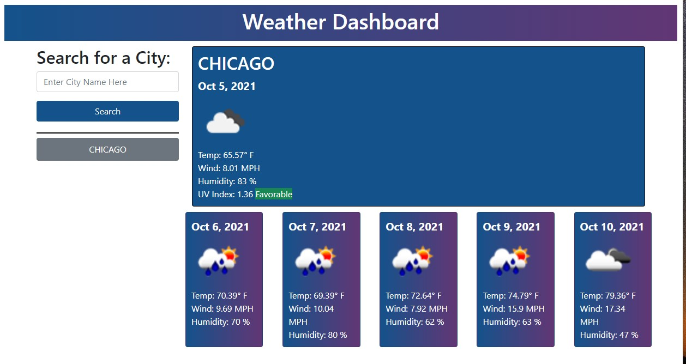

# weather-dashboard
 
 ## Purpose
The purpose of this project was to create a weather dashboard that would display the weather outlook for multiple cities so users can plan a trip accordingly.

## Description
A user can use the search bar to search for a specific city. When they do so, the user will be presented with the current weather along with a 5-day forecast. The city will also be saved as a button below the search bar so the user can quickly access the weather information for previously searched cities.

## Technology Used
* HTML
* CSS
* JavaScript
* Bootstrap
* Moment.js
* OpenWeather API

## Screenshots

## Credits
* https://www.w3schools.com/css/css3_gradients.asp
* https://www.w3schools.com/jsref/jsref_unshift.asp
* https://www.w3schools.com/jsref/prop_element_classlist.asp

## License
MIT License

Copyright (c) [2021] [Alex Christianson]

Permission is hereby granted, free of charge, to any person obtaining a copy
of this software and associated documentation files (the "Software"), to deal
in the Software without restriction, including without limitation the rights
to use, copy, modify, merge, publish, distribute, sublicense, and/or sell
copies of the Software, and to permit persons to whom the Software is
furnished to do so, subject to the following conditions:

The above copyright notice and this permission notice shall be included in all
copies or substantial portions of the Software.

THE SOFTWARE IS PROVIDED "AS IS", WITHOUT WARRANTY OF ANY KIND, EXPRESS OR
IMPLIED, INCLUDING BUT NOT LIMITED TO THE WARRANTIES OF MERCHANTABILITY,
FITNESS FOR A PARTICULAR PURPOSE AND NONINFRINGEMENT. IN NO EVENT SHALL THE
AUTHORS OR COPYRIGHT HOLDERS BE LIABLE FOR ANY CLAIM, DAMAGES OR OTHER
LIABILITY, WHETHER IN AN ACTION OF CONTRACT, TORT OR OTHERWISE, ARISING FROM,
OUT OF OR IN CONNECTION WITH THE SOFTWARE OR THE USE OR OTHER DEALINGS IN THE
SOFTWARE.

### Deployed website
https://alexchristianson.github.io/weather-dashboard/
